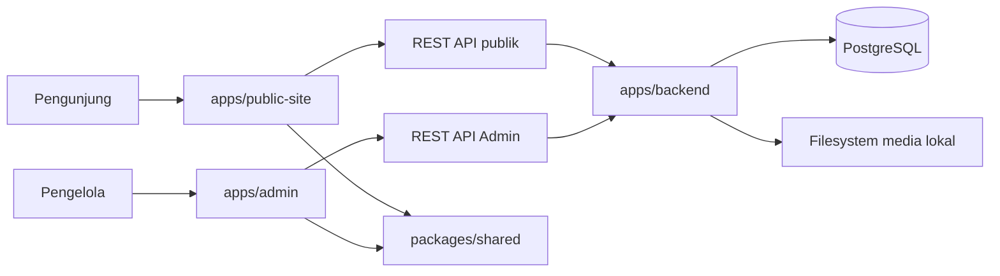

# Arsitektur Talenta Prestasi

## Status dan Tujuan

Talenta Prestasi adalah platform website kategori lomba multi-periode. Satu kategori memakai satu slug/subdomain tetap, sedangkan data lomba setiap tahun atau periode disimpan sebagai Event di dalam kategori tersebut. Pendaftaran dan dashboard peserta berada pada website eksternal di luar repository ini.

## Gambaran Sistem



Backend NestJS memakai TypeORM untuk koneksi dan entity PostgreSQL. PostgreSQL merupakan sumber data otoritatif; filesystem backend menyimpan file media dan PostgreSQL menyimpan metadata/referensinya.

## Hierarki Domain

```text
Organization
└── CompetitionCategory
    ├── slug/subdomain dan status publikasi
    ├── EventSite aktif
    └── EventSite nonaktif → arsip otomatis
```

- **Organization** adalah tenant tertinggi.
- **CompetitionCategory** adalah kategori lomba tetap, misalnya `octal`; kategori memiliki slug/subdomain, identitas penyelenggara, field logo/favicon legacy, dan status publikasi.
- **EventSite** adalah penyelenggaraan pada `period_year` tertentu, dengan `batch_number` otomatis dan `batch_label` opsional bila satu tahun memiliki beberapa gelombang. Nama ajang mengikuti Kategori; slug hanya identifier teknis. Logo Event disimpan pada `event_sites.logo_asset_id`, terpisah dari maskot Event serta logo/favicon Kategori legacy.
- Hanya satu Event dapat aktif dalam satu kategori. Event nonaktif yang pernah diaktifkan menjadi arsip; Event masa depan yang belum pernah aktif tetap berstatus persiapan.
- Tidak ada entity `Competition` dan tidak ada relasi sumber arsip manual.

## Batas Aplikasi

- `apps/public-site/`: website production pengunjung dan visual baseline preview.
- `apps/admin/`: CMS untuk login, memilih kategori/Event, mengelola konten/media, dan preview responsif.
- `apps/backend/`: REST API NestJS untuk autentikasi, tenant/RBAC, validasi, PostgreSQL, dan media.
- `packages/shared/`: kontrak browser yang benar-benar dipakai Public Site dan Admin.

Browser tidak mengakses PostgreSQL atau path filesystem secara langsung. Admin menulis melalui Admin API; Public Site hanya membaca DTO publik.

## Resolusi Public Site

1. Hostname diverifikasi melalui `site_domains` dan mengarah ke CompetitionCategory.
2. Resolver memilih satu Event `is_active=true`, `status='active'`, dan belum soft delete dari kategori tersebut.
3. Kategori harus aktif, published, belum soft delete, dan Organization harus aktif.
4. Event aktif harus memiliki snapshot publik; request pengunjung membaca snapshot tersebut, bukan workspace draf Admin.
5. Bootstrap mengembalikan identitas kategori, settings Event, route publik, dan `currentEvent` dari satu versi snapshot yang konsisten.
6. Arsip mengambil snapshot publik semua Event nonaktif yang belum soft delete dalam kategori yang sama; draf Event arsip tidak bocor ke publik.
7. Detail arsip memakai `eventSlug`; URL browser menggunakan query `?event=...`.

Admin menyimpan seluruh perubahan modul ke satu workspace draf Event. **Publikasikan perubahan** membangun dan mengganti snapshot publik dalam satu transaksi. Preview Admin memakai Public Site asli dan token read-only 15 menit yang terikat ke pengguna, tenant, kategori, dan Event; token login Admin tidak diteruskan ke Public Site.

Snapshot workspace lama yang tidak memiliki `logo_asset_id` mempertahankan logo Event saat dipulihkan dan memakai ukuran default 36 piksel jika `navbar_logo_size` tidak ada. Migration logo mengisi workspace dari maskot Event atau logo Kategori legacy, tetapi tidak menulis ulang snapshot publik existing. Logo baru terlihat publik setelah workspace dipublikasikan lagi.

Endpoint publik menyediakan bootstrap, Beranda, Unduh, FAQ, Pemenang, Arsip, dan Detail Arsip. Media tersedia melalui `/api/v1/public/media/<asset-id>`. Media publik hanya dapat dibaca jika asset berada pada allowlist snapshot publik atau request membawa token preview Event yang sah.

## Alur CMS Admin

1. Pengguna login melalui `/api/v1/auth/login`; JWT disimpan pada `sessionStorage`.
2. `/api/v1/admin/session` mengembalikan Organization dan kategori yang dapat diakses.
3. Admin memilih kategori, lalu memuat Event melalui `/api/v1/admin/categories/:categoryId/events`.
4. Admin memilih Event sebagai konteks editor.
5. Editor membaca/menulis satu workspace draf melalui `/api/v1/admin/events/:eventId/...`.
6. Admin dapat membuka preview aman, memublikasikan seluruh draf Event, atau membatalkan draf ke snapshot terakhir.
7. Owner/admin dapat membuat, mengubah, menghapus, memublikasikan kategori, dan mengaktifkan Event sesuai aturan service.
8. Owner/admin/editor dapat mengubah dan memublikasikan konten Event; viewer hanya membaca dan preview.

`sessionStorage` hanya menyimpan autentikasi dan konteks pilihan. Konten tetap berasal dari API/PostgreSQL.

## Kepemilikan Pengaturan

**Level kategori:**

- nama kategori dan slug/subdomain tetap;
- penyelenggara serta field logo/favicon legacy;
- status operasional dan publikasi;
- domain publik.

**Level Event:**

- nama, slug periode internal, deskripsi, maskot/fallback icon, dan status aktif;
- logo Event pada `event_sites.logo_asset_id` untuk navbar sekaligus favicon;
- ukuran logo navbar pada `site_settings.navbar_logo_size`, satu nilai 24–44 piksel untuk desktop, tablet, dan mobile, default 36;
- warna, navigasi, kontak, footer, SEO;
- Beranda, dokumen, tab Unduh, FAQ, kategori pemenang, pemenang, SK, dan page/detail settings.

Slug kategori ditentukan saat kategori dibuat dan tidak diedit melalui Pengaturan Event.

## Tenant, Auth, dan RBAC

Membership menghubungkan User ke Organization dengan role `owner`, `admin`, `editor`, atau `viewer`.

- Semua endpoint Admin memerlukan JWT.
- Query memverifikasi membership Organization pada kategori/Event target.
- Operasi administratif kategori/Event dibatasi ke owner/admin.
- Mutasi konten/media menerima owner/admin/editor.
- Viewer hanya memperoleh akses baca.
- Foreign key gabungan dan pemeriksaan ownership menjaga kategori pemenang, pemenang, SK, dan media tetap pada scope Event/tenant yang benar. Khusus tab Unduh, dokumen dari Event lain hanya dapat direferensikan jika kedua Event berada dalam Kategori Lomba yang sama; referensi lintas kategori atau tenant ditolak.

Global `ValidationPipe` memakai whitelist, menolak field asing, dan mentransformasi input. `JWT_SECRET` wajib minimal 32 karakter.

## Media

Upload media Admin memakai `/api/v1/admin/events/:eventId/media`. Backend menerima PNG/JPEG/WebP/SVG maksimal 5 MB dan PDF maksimal 10 MB, memeriksa MIME/signature, menolak pola SVG berbahaya dasar, membuat storage key UUID serta checksum, dan menghapus file jika penyimpanan metadata gagal. Logo Event dibatasi ke PNG/JPEG/WebP maksimal 5 MB.

Preview binary Admin memakai `GET /api/v1/admin/events/:eventId/media/:assetId`. Endpoint ini memerlukan JWT dan membership tenant/Event. Browser mengambil binary sebagai Blob lalu membuat Object URL untuk gambar; Object URL hanya berada dalam state memori, tidak pernah disimpan ke `localStorage`, dan dicabut saat diganti, dihapus, dimuat ulang, atau halaman dilepas. Kebijakan ini berbeda dari media publik yang mensyaratkan token preview atau allowlist snapshot publik.

Root storage default adalah `apps/backend/storage/uploads/` relatif working directory backend dan dapat dioverride dengan `LOCAL_STORAGE_PATH`.

## Routing dan Gateway

Canonical route browser berada di `packages/shared/js/core/paths.js`. Workspace development:

- Public Site: `/apps/public-site/`
- Admin: `/apps/admin/`

Gateway production-like memetakan `/`, `/unduh/`, `/pemenang/`, `/arsip/`, `/arsip/detail/`, dan `/faq/`, meneruskan `/api/`, serta tidak mengekspos Admin atau file repository.

## Public Site sebagai Visual Baseline

Markup, class, token tema, dan responsive behavior Public Site menjadi acuan preview Admin. Preview menggunakan viewport desktop, tablet, dan mobile tanpa membuat implementasi visual alternatif.

## Sumber Kebenaran

Urutan sumber kebenaran:

1. implementasi dan executable test;
2. keputusan produk terbaru;
3. dokumentasi aktif;
4. dokumentasi historis di `docs/archive/`.

Hasil validasi aktual dicatat di `PROGRESS.md`; aktivitas yang mengubah file dicatat di `docs/WORK_LOG.md`.
