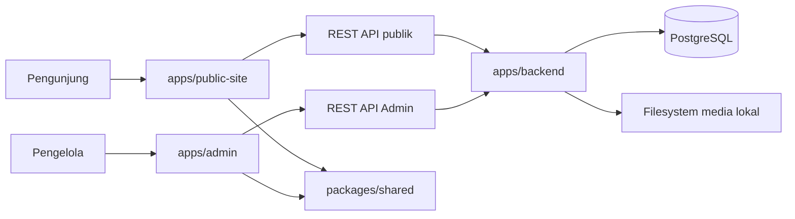

# Arsitektur Talenta Prestasi

## Status dan Tujuan

Talenta Prestasi adalah platform website kategori lomba multi-periode. Satu kategori memakai satu slug/subdomain tetap, sedangkan data lomba setiap tahun atau periode disimpan sebagai Event di dalam kategori tersebut. Pendaftaran dan dashboard peserta berada pada website eksternal di luar repository ini.

## Gambaran Sistem



Backend NestJS memakai TypeORM untuk koneksi dan entity PostgreSQL. PostgreSQL merupakan sumber data otoritatif; filesystem backend menyimpan file media dan PostgreSQL menyimpan metadata/referensinya.

## Hierarki Domain

```text
Organization
└── CompetitionCategory
    ├── slug/subdomain dan status publikasi
    ├── EventSite aktif
    └── EventSite nonaktif → arsip otomatis
```

- **Organization** adalah tenant tertinggi.
- **CompetitionCategory** adalah kategori lomba tetap, misalnya `octal`; kategori memiliki slug/subdomain, identitas penyelenggara, logo/favicon, dan status publikasi.
- **EventSite** adalah event/periode di dalam kategori, misalnya `Octal 2026`; Event memiliki konten dan pengaturan visual per periode.
- Hanya satu Event dapat aktif dalam satu kategori. Event lain yang belum dihapus menjadi arsip otomatis.
- Tidak ada entity `Competition` dan tidak ada relasi sumber arsip manual.

## Batas Aplikasi

- `apps/public-site/`: website production pengunjung dan visual baseline preview.
- `apps/admin/`: CMS untuk login, memilih kategori/Event, mengelola konten/media, dan preview responsif.
- `apps/backend/`: REST API NestJS untuk autentikasi, tenant/RBAC, validasi, PostgreSQL, dan media.
- `packages/shared/`: kontrak browser yang benar-benar dipakai Public Site dan Admin.

Browser tidak mengakses PostgreSQL atau path filesystem secara langsung. Admin menulis melalui Admin API; Public Site hanya membaca DTO publik.

## Resolusi Public Site

1. Hostname diverifikasi melalui `site_domains` dan mengarah ke CompetitionCategory.
2. Resolver memilih satu Event `is_active=true`, `status='active'`, dan belum soft delete dari kategori tersebut.
3. Kategori harus aktif, published, belum soft delete, dan Organization harus aktif.
4. Event aktif harus memiliki snapshot publik; request pengunjung membaca snapshot tersebut, bukan workspace draf Admin.
5. Bootstrap mengembalikan identitas kategori, settings Event, route publik, dan `currentEvent` dari satu versi snapshot yang konsisten.
6. Arsip mengambil snapshot publik semua Event nonaktif yang belum soft delete dalam kategori yang sama; draf Event arsip tidak bocor ke publik.
7. Detail arsip memakai `eventSlug`; URL browser menggunakan query `?event=...`.

Admin menyimpan seluruh perubahan modul ke satu workspace draf Event. **Publikasikan perubahan** membangun dan mengganti snapshot publik dalam satu transaksi. Preview Admin memakai Public Site asli dan token read-only 15 menit yang terikat ke pengguna, tenant, kategori, dan Event; token login Admin tidak diteruskan ke Public Site.

Endpoint publik menyediakan bootstrap, Beranda, Unduh, FAQ, Pemenang, Arsip, dan Detail Arsip. Media tersedia melalui `/api/v1/public/media/<asset-id>`.

## Alur CMS Admin

1. Pengguna login melalui `/api/v1/auth/login`; JWT disimpan pada `sessionStorage`.
2. `/api/v1/admin/session` mengembalikan Organization dan kategori yang dapat diakses.
3. Admin memilih kategori, lalu memuat Event melalui `/api/v1/admin/categories/:categoryId/events`.
4. Admin memilih Event sebagai konteks editor.
5. Editor membaca/menulis satu workspace draf melalui `/api/v1/admin/events/:eventId/...`.
6. Admin dapat membuka preview aman, memublikasikan seluruh draf Event, atau membatalkan draf ke snapshot terakhir.
7. Owner/admin dapat membuat, mengubah, menghapus, memublikasikan kategori, dan mengaktifkan Event sesuai aturan service.
8. Owner/admin/editor dapat mengubah dan memublikasikan konten Event; viewer hanya membaca dan preview.

`sessionStorage` hanya menyimpan autentikasi dan konteks pilihan. Konten tetap berasal dari API/PostgreSQL.

## Kepemilikan Pengaturan

**Level kategori:**

- nama kategori dan slug/subdomain tetap;
- penyelenggara, logo, favicon;
- status operasional dan publikasi;
- domain publik.

**Level Event:**

- nama, slug periode internal, deskripsi, maskot/fallback icon, dan status aktif;
- warna, navigasi, kontak, footer, SEO;
- Beranda, dokumen, tab Unduh, FAQ, kategori pemenang, pemenang, SK, dan page/detail settings.

Slug kategori ditentukan saat kategori dibuat dan tidak diedit melalui Pengaturan Event.

## Tenant, Auth, dan RBAC

Membership menghubungkan User ke Organization dengan role `owner`, `admin`, `editor`, atau `viewer`.

- Semua endpoint Admin memerlukan JWT.
- Query memverifikasi membership Organization pada kategori/Event target.
- Operasi administratif kategori/Event dibatasi ke owner/admin.
- Mutasi konten/media menerima owner/admin/editor.
- Viewer hanya memperoleh akses baca.
- Foreign key gabungan dan pemeriksaan ownership mencegah dokumen, kategori pemenang, pemenang, tab Unduh, atau media menyeberangi Event/tenant.

Global `ValidationPipe` memakai whitelist, menolak field asing, dan mentransformasi input. `JWT_SECRET` wajib minimal 32 karakter.

## Media

Upload media Admin memakai `/api/v1/admin/events/:eventId/media`. Backend menerima PNG/JPEG/WebP/SVG maksimal 5 MB dan PDF maksimal 10 MB, memeriksa MIME/signature, menolak pola SVG berbahaya dasar, membuat storage key UUID serta checksum, dan menghapus file jika penyimpanan metadata gagal.

Root storage default adalah `apps/backend/storage/uploads/` relatif working directory backend dan dapat dioverride dengan `LOCAL_STORAGE_PATH`.

## Routing dan Gateway

Canonical route browser berada di `packages/shared/js/core/paths.js`. Workspace development:

- Public Site: `/apps/public-site/`
- Admin: `/apps/admin/`

Gateway production-like memetakan `/`, `/unduh/`, `/pemenang/`, `/arsip/`, `/arsip/detail/`, dan `/faq/`, meneruskan `/api/`, serta tidak mengekspos Admin atau file repository.

## Public Site sebagai Visual Baseline

Markup, class, token tema, dan responsive behavior Public Site menjadi acuan preview Admin. Preview menggunakan viewport desktop, tablet, dan mobile tanpa membuat implementasi visual alternatif.

## Sumber Kebenaran

Urutan sumber kebenaran:

1. implementasi dan executable test;
2. keputusan produk terbaru;
3. dokumentasi aktif;
4. dokumentasi historis di `docs/archive/`.

Hasil validasi aktual dicatat di `PROGRESS.md`; aktivitas yang mengubah file dicatat di `docs/WORK_LOG.md`.
