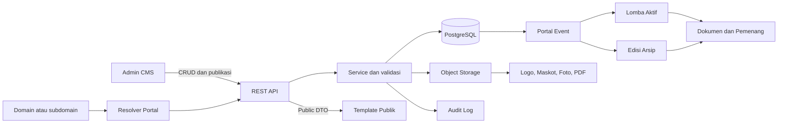
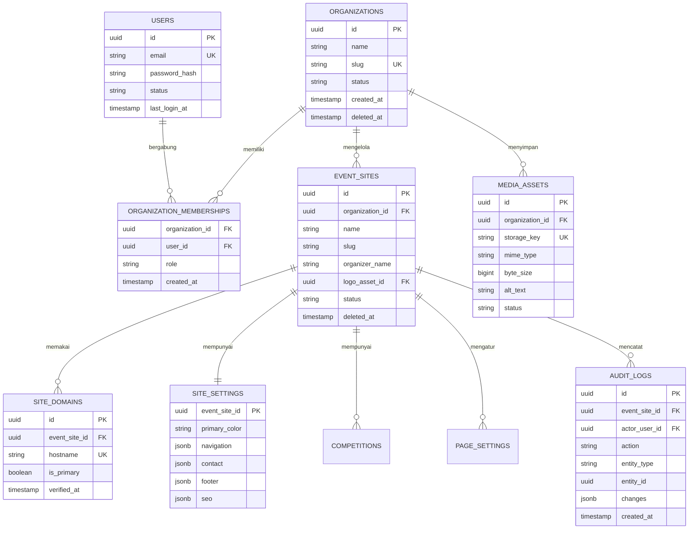
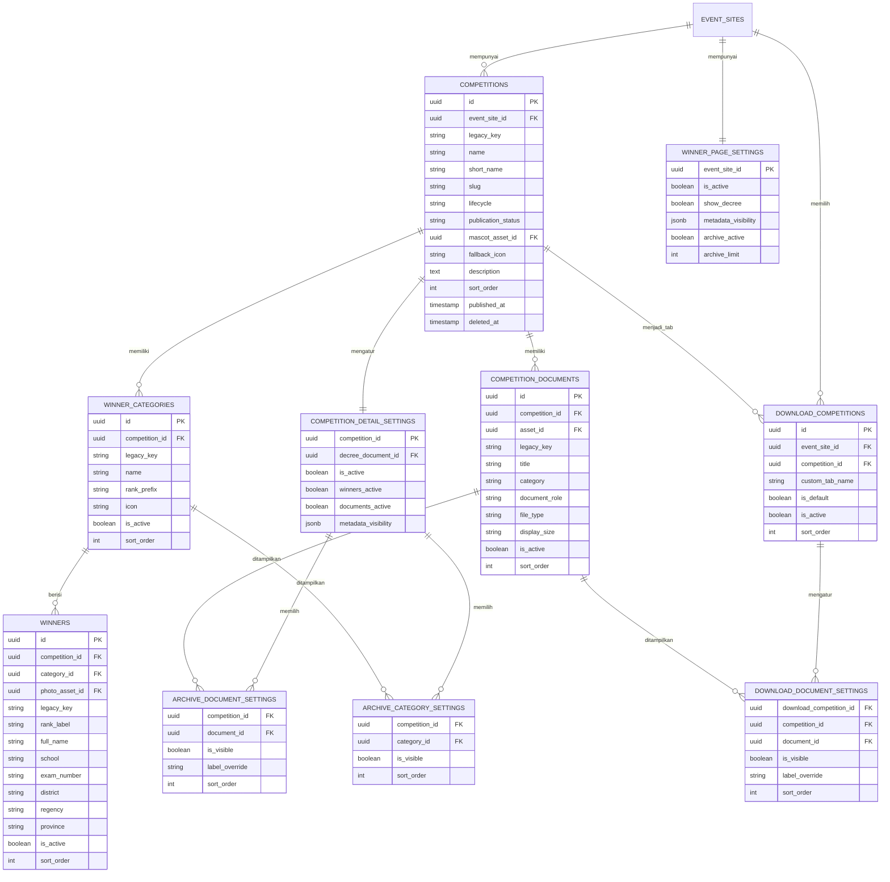
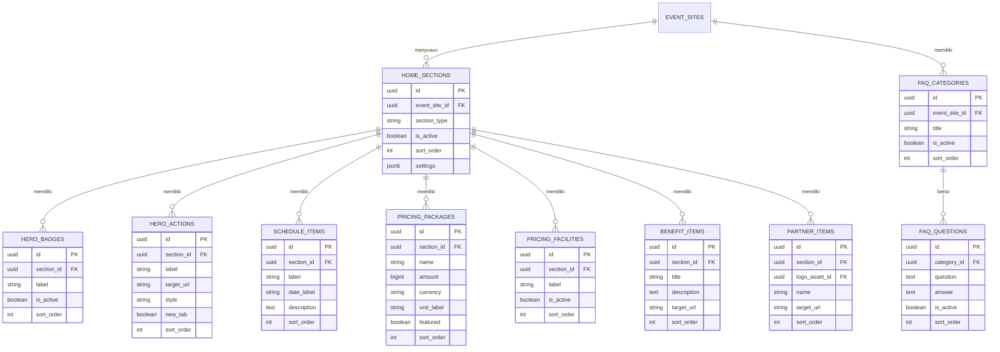
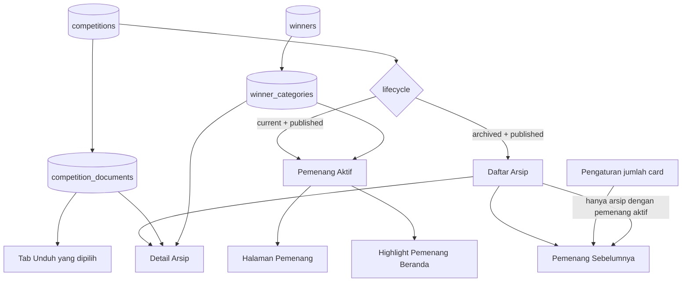
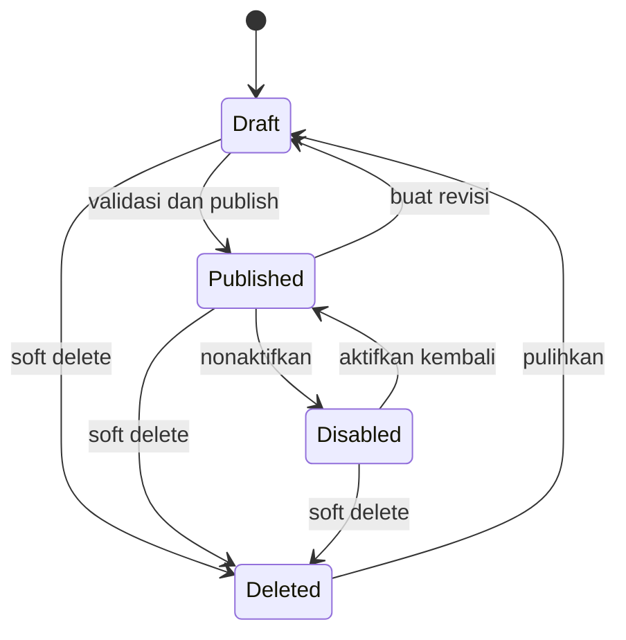

# Rancangan Database Produksi Talenta Prestasi

## Ringkasan untuk Client

Talenta Prestasi saat ini telah memiliki frontend Template dan Admin yang saling
terhubung melalui database dummy serta `localStorage`. Rancangan pada dokumen ini
adalah target database produksi agar struktur tersebut dapat dipindahkan ke
backend tanpa mengubah desain halaman yang sudah disetujui.

Keputusan utamanya adalah memisahkan tiga konsep berikut:

1. **Organisasi** adalah client atau penyelenggara yang memiliki akun Admin.
2. **Portal event** adalah website/subdomain beserta identitas, tema, navigasi,
   Beranda, Unduh, Pemenang, Arsip, dan FAQ.
3. **Edisi lomba** adalah lomba aktif atau lomba terdahulu yang memiliki dokumen,
   kategori juara, pemenang, SK, serta logo/maskot sendiri.

Dengan model ini, satu client dapat memiliki beberapa portal, satu portal dapat
dipakai berulang untuk banyak edisi lomba, dan seluruh halaman tetap membaca
sumber data yang sama tanpa duplikasi.

> **Status implementasi:** dokumen ini adalah rancangan target backend. Frontend
> saat ini masih menggunakan data dummy JavaScript dan `localStorage`.

## Tujuan dan Prinsip

Rancangan database harus:

- mendukung banyak client dan subdomain tanpa mencampur data;
- mempunyai satu sumber data untuk lomba, dokumen, kategori, dan pemenang;
- mempertahankan relasi yang sudah dibuktikan oleh Template dan preview Admin;
- membedakan draft, publikasi, nonaktif, arsip, dan soft delete;
- memudahkan migrasi repository frontend menjadi adapter REST API;
- aman untuk foto, nomor ujian, dan lokasi pemenang;
- menyediakan audit perubahan dan pemulihan data;
- tetap sederhana untuk dirawat setelah backend diterapkan.

## Gambaran Sistem



PostgreSQL direkomendasikan untuk data relasional. Logo, maskot, foto, dan PDF
disimpan di object storage; database hanya menyimpan metadata serta lokasi file.

## Model Domain

### 1. Organisasi dan Portal

| Entitas                    | Fungsi                                              | Relasi utama                                     |
| -------------------------- | --------------------------------------------------- | ------------------------------------------------ |
| `organizations`            | Tenant/client penyelenggara                         | memiliki portal dan anggota                      |
| `users`                    | Identitas akun                                      | bergabung ke organisasi melalui membership       |
| `organization_memberships` | Role pengguna per organisasi                        | FK organisasi dan pengguna                       |
| `event_sites`              | Satu portal publik beserta slug                     | dimiliki organisasi                              |
| `site_domains`             | Domain/subdomain dan status verifikasi              | dimiliki portal                                  |
| `site_settings`            | Tema, kontak, footer, SEO, dan konfigurasi navigasi | satu-ke-satu dengan portal                       |
| `media_assets`             | Metadata file pada object storage                   | dimiliki organisasi, opsional dibatasi ke portal |

Role minimum yang direkomendasikan:

- `owner`: seluruh pengaturan organisasi, anggota, dan portal;
- `admin`: seluruh konten portal;
- `editor`: membuat serta mengubah draft;
- `viewer`: hanya melihat Admin dan preview.

### 2. Edisi Lomba sebagai Sumber Tunggal

| Entitas                       | Fungsi                                        | Relasi utama                          |
| ----------------------------- | --------------------------------------------- | ------------------------------------- |
| `competitions`                | Lomba aktif atau edisi arsip                  | dimiliki satu portal                  |
| `competition_documents`       | Juknis, kisi-kisi, materi, pengumuman, dan SK | dimiliki satu lomba                   |
| `winner_categories`           | Juara Umum, Juara Harapan, dan kategori lain  | dimiliki satu lomba                   |
| `winners`                     | Pemenang pada satu kategori                   | dimiliki kategori dan lomba yang sama |
| `competition_detail_settings` | Heading, toggle metadata, dan SK Detail Arsip | satu-ke-satu dengan lomba             |
| `archive_category_settings`   | Visibilitas/urutan kategori pada Detail Arsip | menunjuk kategori milik lomba         |
| `archive_document_settings`   | Visibilitas, urutan, dan label dokumen Detail | menunjuk dokumen milik lomba          |

`competitions.lifecycle` hanya berisi `current` atau `archived`, sedangkan
`publication_status` berisi `draft`, `published`, atau `disabled`. Pemisahan ini
mencegah istilah “aktif” dipakai untuk dua arti yang berbeda.

Satu portal hanya boleh mempunyai satu lomba `current` yang belum dihapus.
Perubahan lomba aktif dilakukan dalam transaksi:

1. lomba aktif lama diubah menjadi `archived`;
2. lomba baru diubah menjadi `current`;
3. cache publik portal dibersihkan;
4. perubahan dicatat di audit log.

### 3. Konfigurasi Halaman

| Entitas                      | Fungsi                                                           | Owner                 |
| ---------------------------- | ---------------------------------------------------------------- | --------------------- |
| `page_settings`              | Aktif, eyebrow, judul, deskripsi, alignment, dan SEO per halaman | portal                |
| `home_sections`              | Status, urutan, background, dan varian section Beranda           | portal                |
| `hero_badges`                | Badge jenjang pada Hero                                          | section Hero          |
| `hero_actions`               | CTA Hero                                                         | section Hero          |
| `schedule_items`             | Jadwal Penting                                                   | section Jadwal        |
| `pricing_packages`           | Paket Biaya Pendaftaran                                          | section Biaya         |
| `pricing_facilities`         | Daftar fasilitas dengan ikon centang                             | section Biaya         |
| `benefit_items`              | Card Benefit                                                     | section Benefit       |
| `partner_items`              | Logo Mitra & Partner                                             | section Mitra         |
| `winner_page_settings`       | Tampilan metadata, SK, dan jumlah riwayat                        | portal                |
| `download_competitions`      | Edisi yang dipilih sebagai tab Unduh                             | portal dan lomba      |
| `download_document_settings` | Dokumen terlihat serta label override                            | tab Unduh dan dokumen |
| `faq_categories`             | Kelompok pertanyaan                                              | portal                |
| `faq_questions`              | Pertanyaan dan jawaban                                           | kategori FAQ          |

Kolom tampilan yang hanya berupa konfigurasi ringan dapat diletakkan di
`settings_json JSONB` pada `home_sections`. Namun ID relasi, urutan, status
publik, dokumen, kategori, dan pemenang tetap menggunakan kolom/tabel relasional.
Foreign key tidak boleh disimpan hanya di JSON.

## Entity Relationship Diagram

### ERD inti dan multi-tenant



### ERD lomba, Unduh, Pemenang, dan Arsip



### ERD Beranda dan FAQ



## Relasi Data Antarhalaman



Aturan yang harus dipertahankan:

- **Arsip** menampilkan semua lomba terdahulu yang published, aktif, dan Detail
  Arsipnya aktif.
- **Unduh** hanya menampilkan lomba yang dipilih Admin. Karena itu jumlah tab
  Unduh boleh lebih sedikit dari jumlah Arsip.
- **Pemenang Sebelumnya** hanya menampilkan Arsip yang mempunyai minimal satu
  kategori aktif dengan minimal satu pemenang aktif. Karena itu jumlahnya boleh
  lebih sedikit dari jumlah Arsip.
- **Jumlah card** adalah batas tampilan, bukan pembuat data. Nilai efektif tidak
  boleh melebihi jumlah Arsip yang memenuhi syarat.
- Mengubah label atau menyembunyikan dokumen di Unduh/Detail tidak mengubah
  dokumen sumber.
- Highlight Beranda dan halaman Pemenang membaca kategori/pemenang lomba aktif
  yang sama.

## Aturan Integritas Database

### Constraint wajib

1. Slug portal unik di dalam organisasi.
2. Hostname domain unik secara global.
3. Slug lomba unik di dalam portal.
4. Hanya satu lomba `current` per portal.
5. Satu lomba hanya mempunyai satu `competition_detail_settings`.
6. Satu portal hanya mempunyai satu `winner_page_settings`.
7. Satu lomba hanya muncul sekali pada konfigurasi Unduh portal yang sama.
8. Hanya satu tab Unduh aktif yang menjadi default.
9. Kategori, pemenang, dan dokumen yang direferensikan harus dimiliki lomba yang
   sama.
10. `sort_order` tidak negatif dan unik dalam owner jika urutan harus deterministik.
11. File SK harus menunjuk dokumen milik lomba yang sama.
12. Data `published` wajib melewati validasi field publik minimum.

Contoh constraint PostgreSQL:

```sql
CREATE UNIQUE INDEX uq_current_competition_per_site
ON competitions (event_site_id)
WHERE lifecycle = 'current' AND deleted_at IS NULL;

ALTER TABLE competition_documents
ADD CONSTRAINT uq_document_owner UNIQUE (id, competition_id);

ALTER TABLE download_document_settings
ADD CONSTRAINT fk_download_document_same_competition
FOREIGN KEY (document_id, competition_id)
REFERENCES competition_documents (id, competition_id);
```

Pola composite foreign key yang sama diterapkan pada kategori, pemenang, SK,
dan pengaturan Detail Arsip. Validasi service tetap diperlukan untuk pesan error
yang mudah dipahami pengguna.

### Kebijakan hapus

| Aksi                | Kebijakan                                                                              |
| ------------------- | -------------------------------------------------------------------------------------- |
| Hapus portal        | soft delete; domain dinonaktifkan; konten dipertahankan                                |
| Hapus lomba         | soft delete; hilang dari Unduh, Pemenang, dan Arsip                                    |
| Hapus dokumen       | ditolak jika masih menjadi SK; selain itu soft delete dan preference ikut tidak tampil |
| Hapus kategori      | soft delete; pemenang tetap disimpan selama masa retensi                               |
| Hapus pemenang      | soft delete agar audit dan pemulihan tersedia                                          |
| Hapus item tampilan | hard delete boleh setelah audit/revision tersimpan                                     |
| Hapus media         | ditolak jika masih direferensikan; object storage dibersihkan melalui background job   |

`removedCompetitionIds` pada adapter frontend saat ini dipetakan menjadi
`competitions.deleted_at`, bukan menjadi tabel permanen terpisah.

## Status, Draft, dan Publikasi



Untuk tahap pertama, perubahan Admin dapat disimpan langsung sebagai draft pada
record utama dengan `updated_at`, `updated_by`, dan `published_at`. Jika client
membutuhkan approval berjenjang, tambahkan:

- `content_revisions`;
- `approval_requests`;
- `approved_by` dan `approved_at`;
- snapshot JSON sebelum publikasi.

Publikasi sebaiknya berjalan dalam satu transaksi: validasi ownership, simpan
perubahan, tulis audit log, commit, lalu invalidasi cache.

## Media dan File

File tidak disimpan sebagai Base64 di PostgreSQL. Alurnya:

1. Admin meminta signed upload URL;
2. browser mengunggah file ke object storage;
3. backend memvalidasi MIME, ukuran, ekstensi, dan hasil pemindaian;
4. backend membuat `media_assets`;
5. entity menyimpan `media_asset_id`;
6. file baru menjadi publik setelah record terkait dipublikasikan.

`media_assets` minimum memiliki `storage_key`, `original_name`, `mime_type`,
`byte_size`, `checksum`, `width`, `height`, `alt_text`, `status`, `created_by`,
dan timestamp. URL publik dibentuk oleh media service/CDN, bukan disimpan sebagai
sumber kebenaran.

Pemetaan file:

- logo portal → `event_sites.logo_asset_id`;
- gambar Hero → konfigurasi section Hero;
- logo/maskot lomba → `competitions.mascot_asset_id`;
- foto pemenang → `winners.photo_asset_id`;
- PDF → `competition_documents.asset_id`;
- logo partner → `partner_items.logo_asset_id`.

Ikon library tetap disimpan sebagai string terkontrol seperti
`graduation-cap`. Ketika media logo/maskot tersedia, media menjadi pilihan utama
dan ikon library hanya menjadi fallback.

## Keamanan dan Privasi

Data pemenang mengandung informasi yang perlu dilindungi. Rekomendasi minimum:

- jangan membuka email, telepon, atau data login peserta melalui endpoint publik;
- nomor ujian publik dapat dimasking jika client tidak memerlukan nilai penuh;
- foto pemenang memerlukan persetujuan publikasi;
- simpan bukti persetujuan dan versi kebijakan privasi jika proses pendaftaran
  nantinya masuk ke sistem;
- semua query Admin wajib dibatasi `organization_id`/`event_site_id`;
- gunakan PostgreSQL Row Level Security sebagai lapisan tambahan;
- gunakan signed URL untuk media privat dan upload;
- rate limit endpoint publik serta Admin;
- catat login, publish, reset, delete, restore, dan perubahan role pada audit log;
- backup terenkripsi dan uji restore secara berkala.

Dashboard kontingen, peserta, pembayaran, ujian, sertifikat, dan penilaian masih
di luar scope frontend ini. Jika nanti ditambahkan, data tersebut harus berada
pada bounded context terpisah dan hanya mengirim hasil publik yang dibutuhkan
ke modul Pemenang.

## Kontrak API yang Direkomendasikan

### Endpoint publik

```text
GET /api/v1/public/sites/by-host/{hostname}/bootstrap
GET /api/v1/public/sites/{siteSlug}/home
GET /api/v1/public/sites/{siteSlug}/downloads
GET /api/v1/public/sites/{siteSlug}/winners
GET /api/v1/public/sites/{siteSlug}/archives
GET /api/v1/public/sites/{siteSlug}/archives/{competitionSlug}
GET /api/v1/public/sites/{siteSlug}/faq
```

`bootstrap` mengembalikan identitas, tema, navigasi, kontak, footer, route, dan
ringkasan lomba aktif. Endpoint halaman mengembalikan DTO siap render, bukan
seluruh tabel internal.

### Endpoint Admin

```text
GET    /api/v1/admin/sites/{siteId}
PATCH  /api/v1/admin/sites/{siteId}/settings
GET    /api/v1/admin/sites/{siteId}/competitions
POST   /api/v1/admin/sites/{siteId}/competitions
PATCH  /api/v1/admin/competitions/{competitionId}
DELETE /api/v1/admin/competitions/{competitionId}

GET    /api/v1/admin/competitions/{competitionId}/documents
POST   /api/v1/admin/competitions/{competitionId}/documents
GET    /api/v1/admin/competitions/{competitionId}/winner-categories
POST   /api/v1/admin/competitions/{competitionId}/winner-categories

GET    /api/v1/admin/sites/{siteId}/pages/{pageType}
PUT    /api/v1/admin/sites/{siteId}/pages/{pageType}
POST   /api/v1/admin/sites/{siteId}/publish
POST   /api/v1/admin/uploads/presign
```

Semua mutasi menerima `version` atau `If-Match` untuk optimistic locking agar
perubahan dua Admin tidak saling menimpa. Operasi reorder dapat menerima array ID
dan diproses dalam satu transaksi.

### Bentuk respons

```json
{
  "data": {},
  "meta": {
    "version": 12,
    "updatedAt": "2026-07-30T10:00:00Z"
  },
  "errors": []
}
```

Error validasi harus menyertakan `code`, `field`, dan pesan yang dapat langsung
ditampilkan oleh Admin.

## Pemetaan Frontend Saat Ini ke Database

| State frontend                    | Target produksi                                              | Catatan migrasi                        |
| --------------------------------- | ------------------------------------------------------------ | -------------------------------------- |
| `talenta_event_settings_v1`       | `event_sites`, `site_settings`, `site_domains`               | identitas/tema/kontak milik portal     |
| `talenta_home_editor_v1`          | `home_sections` dan tabel item Beranda                       | Highlight tidak menyalin pemenang      |
| `talenta_download_editor_v2`      | `download_competitions`, `download_document_settings`        | hidden ID menjadi `is_visible = false` |
| `talenta_winner_manager_v1`       | `winner_categories`, `winners`, dokumen role SK              | terikat lomba `current`                |
| `talenta_winner_page_v1`          | `winner_page_settings`                                       | `archive_limit` dibatasi hasil query   |
| `talenta_archive_manager_v2`      | `competitions`, dokumen, kategori, pemenang, detail settings | tombstone menjadi `deleted_at`         |
| `talenta_faq_manager_v1` schema 2 | `faq_categories`, `faq_questions`, `page_settings`           | FK pertanyaan ke kategori              |
| data URL upload lokal             | `media_assets` + object storage                              | jangan memindahkan Base64 ke DB        |

ID string seperti `osn-2026` tetap disimpan sementara di `legacy_key` untuk
rekonsiliasi migrasi. Primary key produksi menggunakan UUID/ULID, sedangkan slug
digunakan pada URL publik.

## Urutan Implementasi Backend

### Fase 1 — Fondasi

1. PostgreSQL, migration tool, object storage, dan environment terpisah.
2. `organizations`, `users`, membership, portal, domain, media, dan audit.
3. Resolver tenant berdasarkan hostname.
4. Autentikasi, role, serta pembatasan query per tenant.

### Fase 2 — Sumber data inti

1. Lomba, dokumen, kategori, pemenang, dan Detail Arsip.
2. Constraint owner lomba dan soft delete.
3. Migrasi dummy/localStorage ke seed/importer.
4. Endpoint Admin serta endpoint publik Arsip/Pemenang.

### Fase 3 — Seluruh halaman

1. Pengaturan global dan Beranda.
2. Relasi Unduh tanpa duplikasi dokumen.
3. FAQ.
4. Media upload, publish, cache, dan invalidasi.

### Fase 4 — Kesiapan produksi

1. Optimistic locking, revision, audit viewer, restore, dan backup.
2. Test integrasi relasi serta test end-to-end CRUD.
3. Uji keamanan tenant, upload, role, dan endpoint publik.
4. Observability, rate limit, CDN, serta deployment bertahap.

## Kriteria Penerimaan

Backend dinyatakan sesuai frontend apabila:

- pergantian tema/identitas satu portal tidak memengaruhi portal lain;
- hanya satu lomba aktif muncul pada Pemenang dan Highlight Beranda;
- Unduh tidak membuat salinan dokumen;
- menghapus lomba langsung menghilangkannya dari semua konsumennya;
- jumlah Pemenang Sebelumnya tidak pernah melebihi Arsip valid;
- SK, kategori, pemenang, dan dokumen tidak dapat menunjuk lomba berbeda;
- draft tidak tampil pada endpoint publik;
- preview Admin dan Template menerima DTO yang sama;
- upload tidak menyimpan Base64 di database;
- seluruh perubahan penting dapat dilacak dan dipulihkan.

## Keputusan yang Perlu Disetujui Client

Sebelum implementasi backend dimulai, client perlu mengesahkan:

1. apakah satu organisasi boleh mempunyai lebih dari satu portal/subdomain;
2. siapa yang boleh publish dan apakah diperlukan approval;
3. durasi retensi data pemenang, foto, nomor ujian, dan audit log;
4. apakah nomor ujian ditampilkan penuh atau dimasking;
5. provider domain, email, object storage, CDN, dan backup;
6. apakah dashboard peserta/pembayaran akan menjadi proyek terpisah;
7. kebutuhan impor data lama dan format file sumber;
8. target SLA, jumlah Admin, perkiraan trafik, dan ukuran media.

Dengan persetujuan tersebut, rancangan ini dapat diturunkan menjadi migration SQL,
OpenAPI specification, seed/importer, dan backlog backend tanpa mengubah struktur
Template yang menjadi acuan utama.
