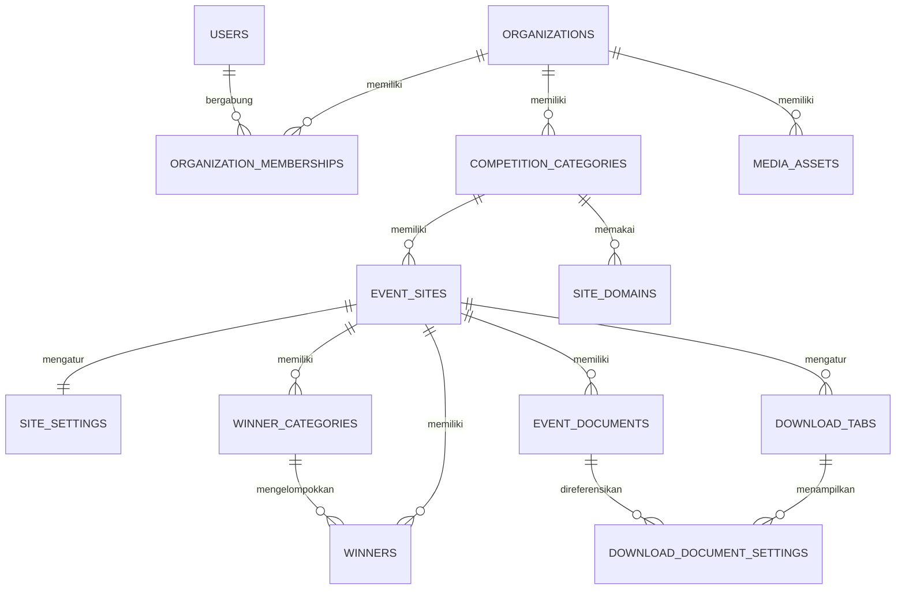

# Model Data Talenta Prestasi

## Status Implementasi

Schema Category→Event telah diterapkan melalui migration TypeORM pada PostgreSQL. Entity dan migration tetap menjadi sumber kebenaran jika ada perbedaan dengan dokumentasi.

## Model Domain



Jalur ownership utama adalah:

```text
Organization → CompetitionCategory → EventSite → konten Event
```

## Organization, Membership, dan User

`organizations` adalah tenant tertinggi. `organization_memberships` memakai primary key `(organization_id, user_id)` dan menyimpan role `owner`, `admin`, `editor`, atau `viewer`. Password User disimpan sebagai hash bcrypt.

## CompetitionCategory

`competition_categories` mewakili kategori lomba/subdomain tetap dan menyimpan:

- `organization_id`, nama, dan slug;
- penyelenggara serta referensi logo/favicon;
- status operasional dan publikasi;
- `published_at`, version, timestamps, dan `deleted_at`.

Constraint slug aktif:

```text
UNIQUE (organization_id, slug) WHERE deleted_at IS NULL
```

`site_domains.category_id` mengikat hostname ke kategori, bukan ke Event. Hostname unik secara global; satu record primary digunakan untuk publikasi kategori.

## EventSite sebagai Event/Periode

`event_sites` mewakili periode lomba dan menyimpan:

- `category_id` dan `organization_id`;
- nama serta slug periode;
- `is_active`, status operasional, deskripsi;
- mascot asset, fallback icon, timestamps, dan `deleted_at`.

Constraint penting:

```text
UNIQUE (category_id, slug) WHERE deleted_at IS NULL
UNIQUE (category_id) WHERE is_active=true AND deleted_at IS NULL
```

Constraint kedua memastikan hanya satu Event aktif per kategori. Event nonaktif lain dalam kategori yang sama menjadi arsip otomatis; tidak ada tabel `event_site_archive_sources`.

## Settings dan Beranda

`site_settings` adalah konfigurasi satu-ke-satu Event untuk warna, navigasi, kontak, footer, dan SEO.

`home_sections` unik berdasarkan `(event_site_id, section_type)`. Item Hero, jadwal, harga, fasilitas, benefit, dan partner mengacu ke section masing-masing.

`page_settings` unik berdasarkan `(event_site_id, page_type)`. `winner_page_settings` menyimpan opsi halaman Pemenang dan `event_detail_settings` menyimpan opsi Detail Arsip/SK pada level Event.

## Dokumen, Pemenang, dan SK

`event_documents` dimiliki Event. Constraint `(id, event_site_id)` dipakai oleh foreign key gabungan agar dokumen tidak dapat direferensikan oleh Event lain.

`winner_categories` dan `winners` dimiliki Event. Pemenang mereferensikan kategori dengan pasangan `(category_id, event_site_id)`.

SK Pemenang disimpan sebagai Event Document dan direferensikan oleh `event_detail_settings.decree_document_id`. Metadata/visibilitas detail arsip berada pada `archive_category_settings` dan `archive_document_settings` dengan ownership Event yang sama.

## Unduh

`download_tabs` dimiliki Event dan menyimpan label tab, status default/aktif, serta urutan. Hanya satu tab default diperbolehkan per Event.

`download_document_settings` menghubungkan tab dengan Event Document melalui `event_site_id`; foreign key gabungan memastikan tab dan dokumen berasal dari Event yang sama. Tabel ini hanya menyimpan visibilitas, label override, dan urutan.

## FAQ

`faq_categories` dimiliki Event dan `faq_questions` dimiliki kategori. Penyimpanan aggregate Admin berlangsung dalam transaksi. Public API hanya mengembalikan kategori dan pertanyaan aktif.

## Media

`media_assets` dimiliki Organization dan menyimpan storage key, nama asli, MIME, ukuran, checksum SHA-256, dimensi opsional, alt text, status, creator, dan waktu pembuatan. File fisik berada di storage lokal; URL publik hanya mengekspos UUID asset.

## Publikasi, Aktivasi, dan Arsip

- CompetitionCategory memakai `publication_status` untuk membuka/menutup situs publik.
- EventSite memakai `is_active` untuk menentukan periode yang tampil.
- Resolver publik mensyaratkan kategori published/aktif, Organization aktif, dan Event aktif/operasional.
- Event nonaktif yang belum soft delete dikembalikan sebagai arsip.
- Soft delete kategori/Event mengeluarkannya dari query aktif tanpa mengandalkan UI.

## Reset Migration

`1786500000000-ResetCategoryEventSchema` adalah reset schema development yang menghapus tabel aplikasi lama tetapi mempertahankan ledger TypeORM `migrations`. Migration discovery hanya memuat file bernama angka agar file `*.spec.ts` tidak dieksekusi sebagai migration.

## Kontrak API

Prefix API adalah `/api/v1`.

Public API:

- `GET /public/sites/by-host/:hostname/bootstrap`
- `GET /public/sites/:categorySlug/bootstrap`
- `GET /public/sites/:categorySlug/home`
- `GET /public/sites/:categorySlug/downloads`
- `GET /public/sites/:categorySlug/faq`
- `GET /public/sites/:categorySlug/winners`
- `GET /public/sites/:categorySlug/archives`
- `GET /public/sites/:categorySlug/archives/:eventSlug`
- `GET /public/media/:assetId`

Admin API utama:

- `GET /admin/session`
- `GET|POST /admin/categories`
- `GET|POST /admin/categories/:categoryId/events`
- `PATCH|DELETE /admin/categories/:categoryId`
- `POST /admin/categories/:categoryId/publish|unpublish`
- `GET|PATCH|DELETE /admin/events/:eventId`
- `POST /admin/events/:eventId/activate|deactivate`
- `/admin/events/:eventId/settings|home|faq|downloads|documents|winner-categories|winners|decree|detail-settings|pages/...`
- `POST /admin/events/:eventId/media`

DTO publik tidak mengekspos password hash, storage key, path fisik, atau ownership internal.
